# 运行uniapp视频插件前提:

## 导入示例项目
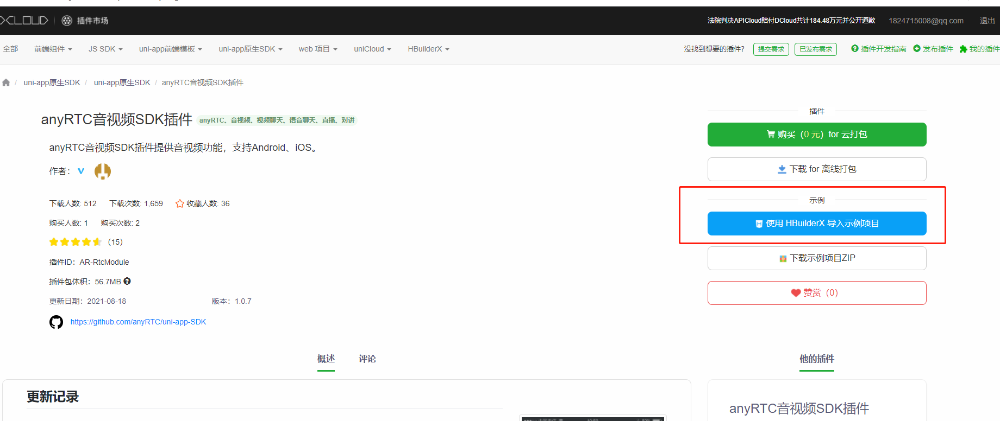

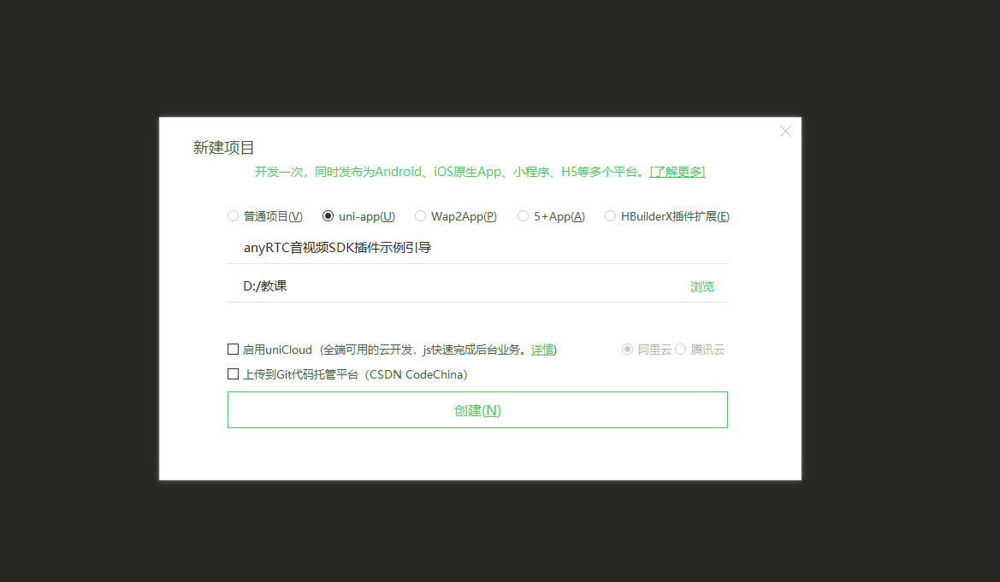

### 导入成功后

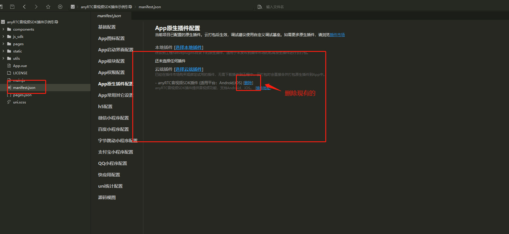

### 删除插件后重新导入插件

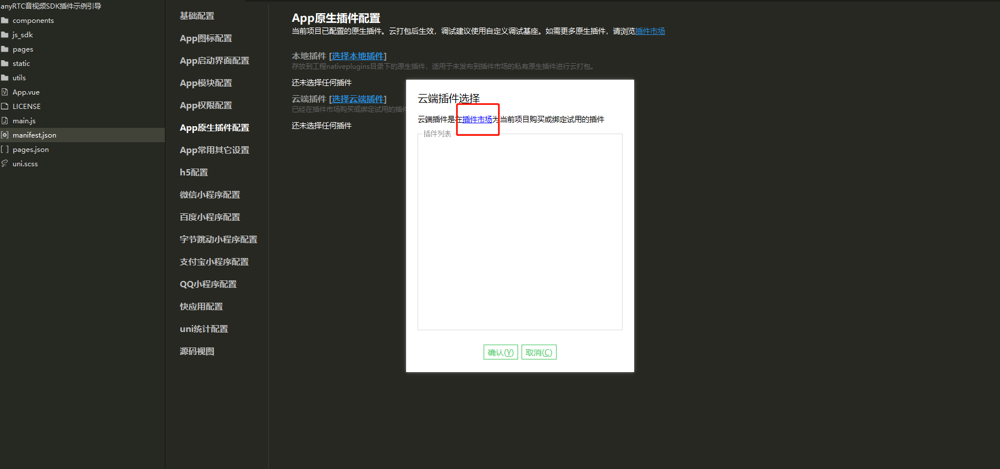

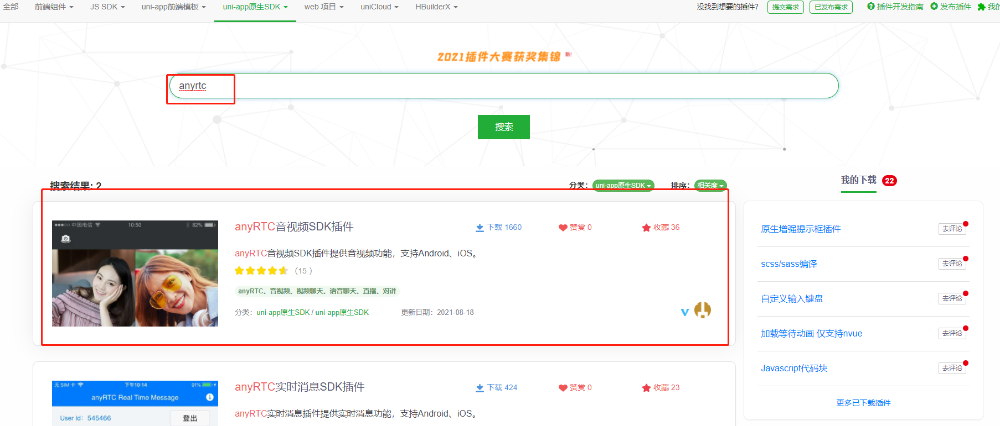

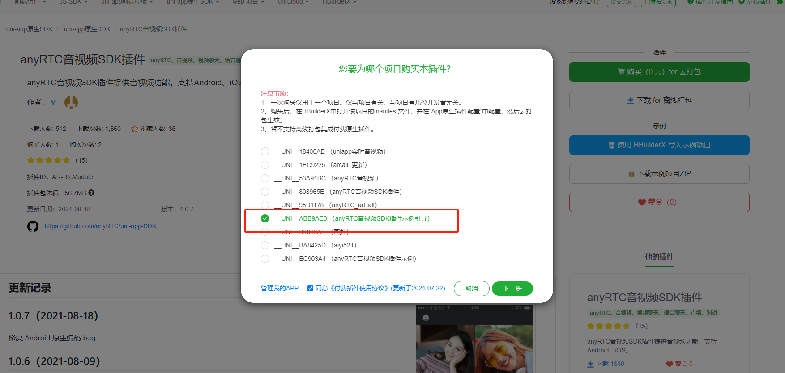

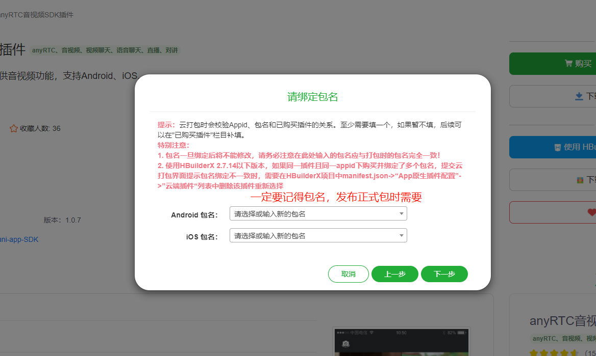

### 绑定成功后关闭再打开即可看到插件

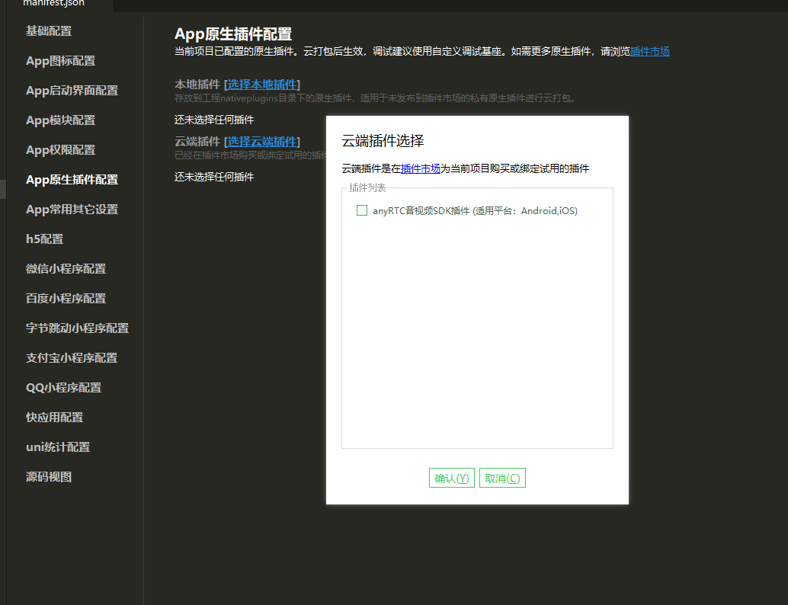

### 选中插件后

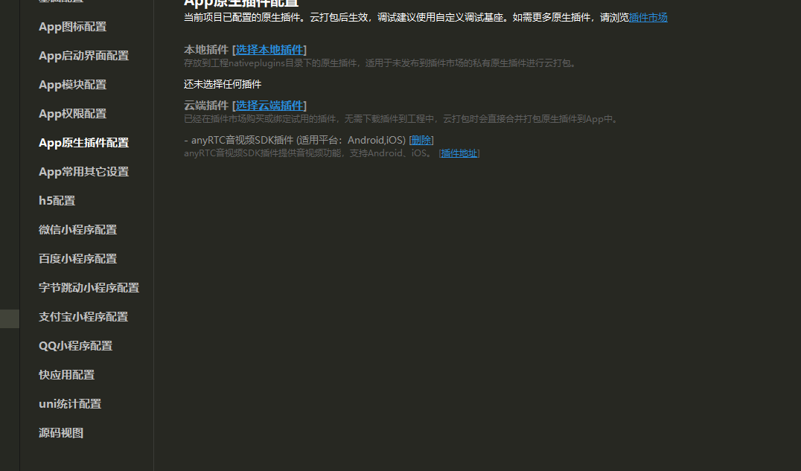

### 制作自定义基座

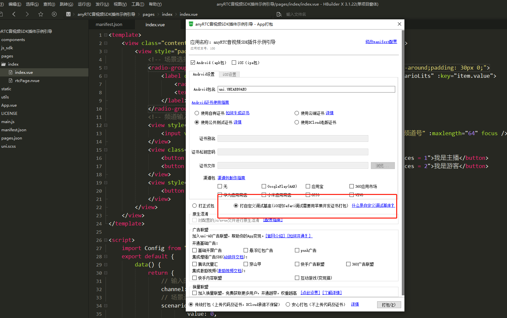

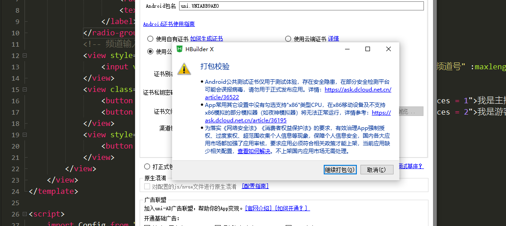

### 在等待自定义基座时可进行配置

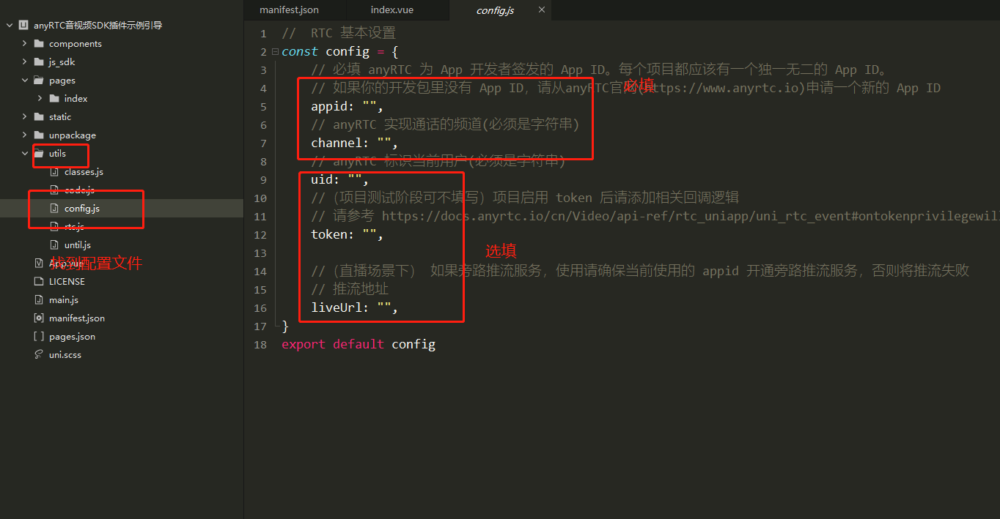

### 自定义基座完成

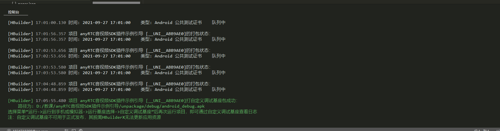

### 选择自定义基座运行

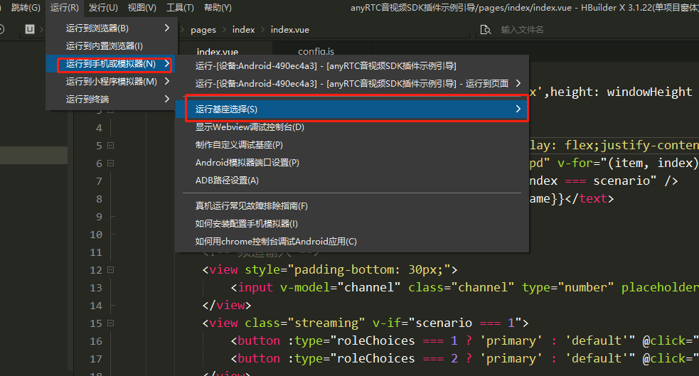

### 运行项目

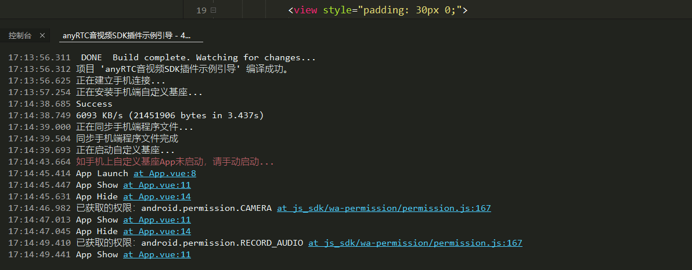

## 页面一直加载中或出现如图所示情况时
### 原因：**使用插件必需使用自定义基座**
### 请前往上方  ` “删除插件后重新导入插件”`开始按步骤操作
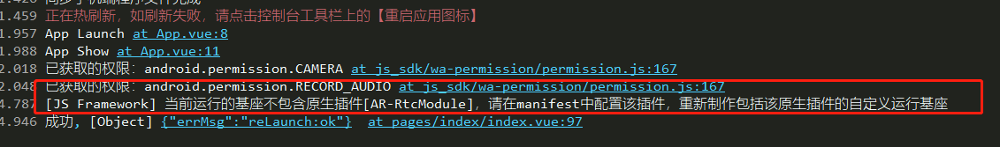